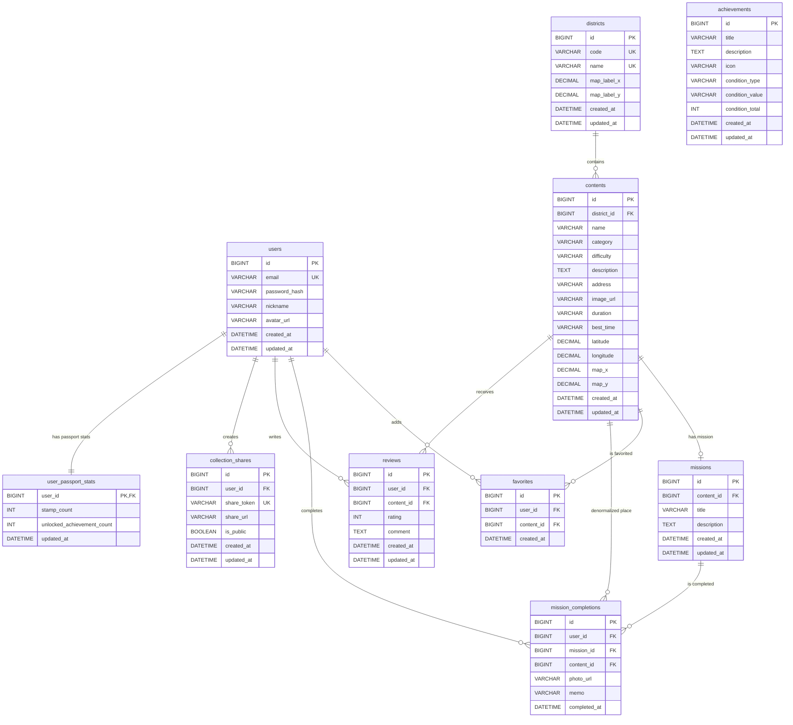

# Hidden Busan ERD 문서

## 1. 기준 자료

이 ERD는 `/Users/dohyun/Downloads/Hidden Busan UI Design.zip`의 Figma Make 코드를 기준으로 재작성했다.

주요 근거 파일은 다음과 같다.

| 파일 | ERD 반영 내용 |
| --- | --- |
| `src/app/components/mockData.ts` | `User`, `Content`, `Mission`, `Favorite`, `MissionCompletion`, `Review`, `CollectionShare`, `Achievement` 타입 |
| `src/app/components/MapPage.tsx` | 부산 구/군 선택 지도, 지역별 장소 필터 |
| `src/app/components/PlacesPage.tsx` | 장소 목록, 카테고리/검색 필터, 찜 상태 |
| `src/app/components/PlaceDetailPage.tsx` | 장소 상세, 미션 이동, 리뷰 작성, 찜 토글 |
| `src/app/components/MissionPage.tsx` | 사진 URL과 한 줄 메모 기반 미션 완료 |
| `src/app/components/PassportPage.tsx` | 완료 기록 기반 패스포트, 스탬프, 업적 진행률 |
| `src/app/components/SharePage.tsx` | 공유 토큰/URL과 패스포트 공유 미리보기 |
| `src/app/components/AuthContext.tsx`, `SignupPage.tsx`, `LoginPage.tsx` | 이메일 로그인, 닉네임, 아바타, 토큰 기반 인증 |

Figma mock data의 ID는 `user-1`, `c1`, `m1`처럼 문자열이지만, 실제 MariaDB/JPA 구현을 고려해 DB PK는 `BIGINT`로 설계했다.

## 2. 설계 요약

- 패스포트 목록은 `mission_completions`를 `missions`, `contents`와 조인해 계산한다.
- 스탬프 개수와 달성 도전과제 개수는 `user_passport_stats`에 계산 캐시로 둘 수 있다. 실제 구현에서는 `mission_completions` 기준 실시간 계산으로 대체해도 된다.
- 도전과제는 `achievements` 기준 데이터를 저장하고, 사용자별 달성 여부는 `mission_completions`를 기준으로 계산한다.
- Figma의 `contents.region`은 실제 DB에서 `districts` 테이블로 정규화한다.
- Figma의 `missionCompletions.contentId`는 화면 조회에서 직접 쓰이므로 `mission_completions.content_id`로 둔다. 정규화만 우선하면 `mission_id`로부터 유도할 수 있지만, 패스포트/공유 조회를 단순화하기 위해 중복 저장한다.
- 공유 URL은 `share_token`으로 생성 가능하지만, Figma mock의 `shareUrl` 필드를 반영해 `share_url`도 저장 가능하게 둔다.

## 3. ERD

## 4. 테이블 정의

### 4.1 users

회원가입, 로그인, 찜, 리뷰, 미션 완료, 공유 링크의 기준 사용자이다.

| 컬럼 | 설명 |
| --- | --- |
| `id` | 사용자 PK |
| `email` | 로그인 이메일, 유니크 |
| `password_hash` | 암호화된 비밀번호 |
| `nickname` | 화면 표시 닉네임 |
| `avatar_url` | 프로필 이미지 URL |
| `created_at`, `updated_at` | 가입/수정 시각 |

### 4.2 districts

부산 지도에서 클릭 가능한 구/군 기준 데이터이다. `MapPage.tsx`의 `DISTRICTS` 배열을 DB 기준 데이터로 옮긴 구조다.

| 컬럼 | 설명 |
| --- | --- |
| `id` | 구/군 PK |
| `code` | `haeundae`, `suyeong` 같은 내부 코드 |
| `name` | 해운대구, 수영구 등 표시 이름 |
| `map_label_x`, `map_label_y` | 지도 이미지 위 라벨 위치 비율 |
| `created_at`, `updated_at` | 등록/수정 시각 |

### 4.3 contents

장소 카드, 지도 마커, 장소 상세 페이지의 핵심 테이블이다. Figma의 `Content` 타입을 기준으로 했다.

| 컬럼 | 설명 |
| --- | --- |
| `id` | 장소 PK |
| `district_id` | 소속 구/군 FK |
| `name` | 장소명 |
| `category` | `명소`, `축제`, `쇼핑`, `시장`, `맛집` |
| `difficulty` | `쉬움`, `보통`, `어려움` |
| `description` | 장소 설명 |
| `address` | 주소 |
| `image_url` | 대표 이미지 URL |
| `duration` | 예상 소요 시간 |
| `best_time` | 추천 방문 시간 |
| `latitude`, `longitude` | 실제 위도/경도 |
| `map_x`, `map_y` | 커스텀 지도 위 마커 위치 |
| `created_at`, `updated_at` | 등록/수정 시각 |

### 4.4 missions

장소별 도전 미션이다. Figma mock에서는 일부 장소에만 미션이 있으며, 화면은 장소당 대표 미션 1개를 조회한다.

| 컬럼 | 설명 |
| --- | --- |
| `id` | 미션 PK |
| `content_id` | 미션이 연결된 장소 FK |
| `title` | 미션 제목 |
| `description` | 수행 방법 |
| `created_at`, `updated_at` | 등록/수정 시각 |

### 4.5 favorites

사용자가 찜한 장소 기록이다.

| 컬럼 | 설명 |
| --- | --- |
| `id` | 찜 PK |
| `user_id` | 찜한 사용자 FK |
| `content_id` | 찜한 장소 FK |
| `created_at` | 찜 등록 시각 |

### 4.6 mission_completions

미션 완료 화면에서 입력하는 사진 URL과 한 줄 메모를 저장한다. 패스포트, 스탬프, 공유 미리보기의 핵심 데이터다.

| 컬럼 | 설명 |
| --- | --- |
| `id` | 미션 완료 PK |
| `user_id` | 완료 사용자 FK |
| `mission_id` | 완료한 미션 FK |
| `content_id` | 완료 장소 FK |
| `photo_url` | 인증 사진 URL |
| `memo` | 한 줄 기록 |
| `completed_at` | 완료 시각 |

### 4.7 reviews

장소 상세의 리뷰 목록과 리뷰 작성 기능을 위한 테이블이다.

| 컬럼 | 설명 |
| --- | --- |
| `id` | 리뷰 PK |
| `user_id` | 작성자 FK |
| `content_id` | 리뷰 대상 장소 FK |
| `rating` | 별점, 1~5 |
| `comment` | 리뷰 내용 |
| `created_at`, `updated_at` | 작성/수정 시각 |

### 4.8 collection_shares

사용자의 패스포트 공유 링크를 저장한다.

| 컬럼 | 설명 |
| --- | --- |
| `id` | 공유 링크 PK |
| `user_id` | 공유 링크 소유자 FK |
| `share_token` | URL에 노출되는 고유 토큰 |
| `share_url` | 완성된 공유 URL, 저장 대신 응답에서 생성해도 됨 |
| `is_public` | 공개 여부 |
| `created_at`, `updated_at` | 생성/수정 시각 |

### 4.9 achievements

패스포트 화면의 도전과제 기준 데이터이다. 사용자별 달성 결과는 저장하지 않고 완료 기록을 기준으로 계산한다.

| 컬럼 | 설명 |
| --- | --- |
| `id` | 업적 PK |
| `title` | 업적명 |
| `description` | 업적 설명 |
| `icon` | 화면 표시 아이콘 또는 아이콘 키 |
| `condition_type` | `category`, `region_any`, `difficulty`, `count_total` |
| `condition_value` | 조건 값. 예: `시장`, `해운대구,수영구,남구,영도구`, `3` |
| `condition_total` | 달성에 필요한 수량 |
| `created_at`, `updated_at` | 등록/수정 시각 |

### 4.10 user_passport_stats

패스포트 상단과 홈 화면에서 보여주는 집계값을 빠르게 조회하기 위한 계산 캐시 테이블이다. 정규화 기준으로는 필수 테이블이 아니며, MVP에서는 `mission_completions`와 `achievements`를 조회해 실시간 계산해도 된다.

| 컬럼 | 설명 |
| --- | --- |
| `user_id` | 사용자 PK이자 `users.id` FK |
| `stamp_count` | 수집한 스탬프 수. 기본 계산식은 사용자가 완료한 고유 장소 수 |
| `unlocked_achievement_count` | 달성한 도전과제 수 |
| `updated_at` | 마지막 계산/동기화 시각 |

## 5. 주요 관계

| 관계 | 카디널리티 | 설명 |
| --- | --- | --- |
| `districts` - `contents` | 1:N | 한 구/군은 여러 장소를 가진다. |
| `contents` - `missions` | 1:0..1 | 한 장소는 대표 미션을 0개 또는 1개 가진다. |
| `users` - `favorites` | 1:N | 한 사용자는 여러 장소를 찜할 수 있다. |
| `contents` - `favorites` | 1:N | 한 장소는 여러 사용자에게 찜될 수 있다. |
| `users` - `mission_completions` | 1:N | 한 사용자는 여러 미션을 완료할 수 있다. |
| `missions` - `mission_completions` | 1:N | 한 미션은 여러 사용자에게 완료될 수 있다. |
| `contents` - `mission_completions` | 1:N | 완료 기록에서 패스포트/공유 조회를 위해 장소를 직접 참조한다. |
| `users` - `reviews` | 1:N | 한 사용자는 여러 리뷰를 작성할 수 있다. |
| `contents` - `reviews` | 1:N | 한 장소는 여러 리뷰를 받을 수 있다. |
| `users` - `collection_shares` | 1:N | 한 사용자는 공유 링크를 생성할 수 있다. |
| `users` - `user_passport_stats` | 1:1 | 한 사용자는 패스포트 집계 캐시를 1개 가진다. |

## 6. 기능별 데이터 흐름

### 6.1 장소 목록과 지도

1. 장소 목록은 `contents`를 조회한다.
2. 지역명은 `contents.district_id`와 `districts.name`을 조인해 만든다.
3. 카테고리 필터는 `contents.category`를 사용한다.
4. 지도 라벨 위치는 `districts.map_label_x`, `districts.map_label_y`를 사용한다.
5. 장소 마커 위치는 `contents.map_x`, `contents.map_y` 또는 `latitude`, `longitude`를 사용한다.

### 6.2 장소 상세

1. `contents.id`로 장소 상세를 조회한다.
2. 대표 미션은 `missions.content_id`로 조회한다.
3. 리뷰는 `reviews.content_id`로 조회한다.
4. 로그인 사용자의 찜 여부는 `favorites.user_id`, `favorites.content_id`로 확인한다.

### 6.3 미션 완료와 패스포트

1. 미션 완료 시 `mission_completions`에 `user_id`, `mission_id`, `content_id`, `photo_url`, `memo`, `completed_at`을 저장한다.
2. 패스포트는 `mission_completions`를 기준으로 완료/진행중 미션을 나눈다.
3. 완료한 장소 수는 `mission_completions.content_id`의 distinct count로 계산한다.
4. 업적 달성 여부는 `achievements.condition_*`와 사용자의 완료 기록을 비교해 계산한다.
5. `user_passport_stats.stamp_count`와 `user_passport_stats.unlocked_achievement_count`는 3~4번 결과를 캐시한 값이다.

### 6.4 공유 링크

1. 사용자가 공유 링크를 만들면 `collection_shares.share_token`을 생성한다.
2. 공유 페이지는 토큰으로 `collection_shares`를 찾고 해당 `user_id`의 완료 기록을 조회한다.
3. 공유 미리보기는 `mission_completions`, `contents`, `missions`, `users`를 조합해 만든다.

## 7. 제약 조건과 인덱스

| 테이블 | 제약 또는 인덱스 | 목적 |
| --- | --- | --- |
| `users` | `UNIQUE(email)` | 이메일 중복 가입 방지 |
| `districts` | `UNIQUE(code)`, `UNIQUE(name)` | 구/군 기준 데이터 중복 방지 |
| `contents` | `INDEX(district_id)`, `INDEX(category)`, `INDEX(difficulty)` | 지역/카테고리/난이도 필터 |
| `contents` | `INDEX(latitude, longitude)` | 지도 범위 조회 확장 대비 |
| `missions` | `UNIQUE(content_id)` | 장소당 대표 미션 1개 보장 |
| `favorites` | `UNIQUE(user_id, content_id)` | 중복 찜 방지 |
| `mission_completions` | `UNIQUE(user_id, mission_id)` | 같은 미션 중복 완료 방지 |
| `mission_completions` | `INDEX(user_id, completed_at)` | 패스포트 조회 |
| `reviews` | `INDEX(content_id, created_at)` | 장소 상세 리뷰 목록 조회 |
| `collection_shares` | `UNIQUE(share_token)` | 공유 토큰 충돌 방지 |
| `achievements` | `INDEX(condition_type)` | 업적 계산 조건 분류 |
| `user_passport_stats` | `PRIMARY KEY(user_id)` | 사용자당 패스포트 집계 1개 보장 |

## 8. 구현 시 주의점

- `mission_completions.content_id`는 `missions.content_id`와 항상 같아야 한다. 서비스 레이어에서 검증하거나 DB 트리거 없이 애플리케이션 로직으로 보장한다.
- `share_url`은 저장하지 않고 `SERVER_DOMAIN + /share/ + share_token`으로 생성해도 된다.
- Figma의 업적은 동적으로 계산되므로 MVP에는 `user_achievements`가 필요 없다. 달성 시각을 저장해야 하면 이후 `user_achievements(user_id, achievement_id, unlocked_at)`를 추가한다.
- `user_passport_stats`는 정합성 관점에서 원천 데이터가 아니다. 미션 완료/삭제가 생기면 서비스 레이어에서 재계산하거나, MVP에서는 테이블 없이 응답 DTO에서 계산해도 된다.
- 리뷰를 사용자당 장소 1개로 제한하려면 `reviews`에 `UNIQUE(user_id, content_id)`를 추가한다. 현재 Figma 화면은 중복 작성 제한 UI가 없어서 기본안에는 넣지 않았다.
